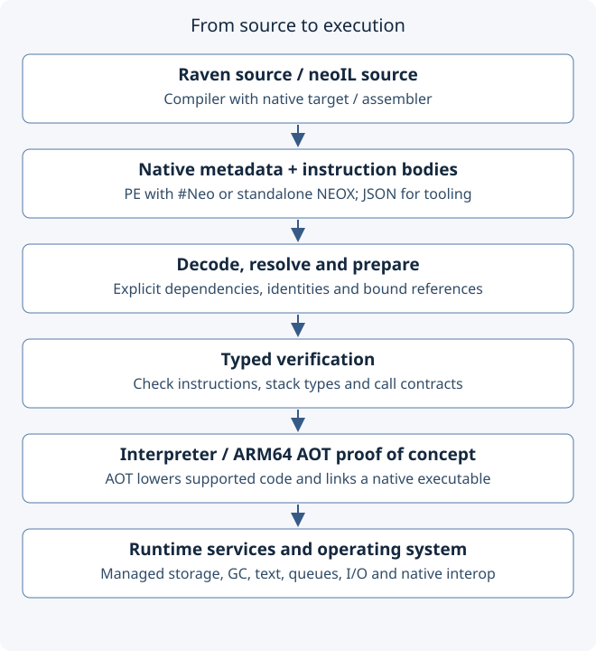
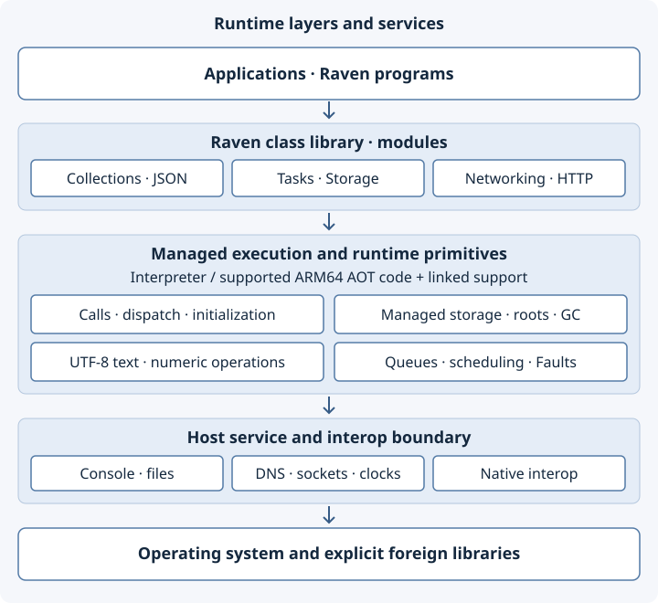

# neoCLR architecture

Current implementation overview, reviewed 2026-10-09. This describes the development
checkout, not a guarantee that every capability is in the published bundle. The
[platform roadmap](platform-roadmap.md) remains the sequencing authority.

neoCLR combines a managed runtime, a Raven class library, compiler integration and
project/editor tools. .NET supplies the ergonomic baseline: typed code, assemblies,
generics, interfaces and managed storage. neoCLR owns its execution semantics and
runtime services; it is not a replacement CLR for arbitrary .NET binaries.

## Source and tools

Raven binds source through its compiler and selects a target-specific metadata/emission
path. The native target emits neoCLR artifacts and imports native library symbols.
The ordinary .NET target remains separate. The neoIL assembler supplies a direct path
for runtime tests and low-level programs. Its instructions are a typed runtime model,
not a claim that every operation has an ECMA CIL byte encoding.

Projects, the language server and documentation tools consume metadata alongside the
compiler. Native symbols should retain their assembly and declaration-module owners
rather than acquire invented CLR container types. The earlier bounded CLI import bridge
is a separate compatibility workflow; it does not define native semantics. See
[Raven integration](raven-cli-bridge.md) and [metadata format](metadata-format.md).

## Artifact admission and shared program state

The native reader decodes PE/#Neo or standalone NEOX into `Module`. JSON remains an
inspection/intermediate input. Container validation checks framing and encoding; it
cannot establish that an instruction body is well typed. Dependency resolution and
preparation bind references and preserve definition identity. `LoadedProgram` is the
Rust representation of the prepared metadata snapshot. Loading and typed verification
are separate operations; loading does not execute initializers or application code.

Typed verification checks the resolved instruction model before execution. An execution
owns frames, allocations, output and native-library state; an explicitly supplied host
console can share external I/O state. Metadata is not a serialization of these live
objects. These host APIs are not a stable native embedding ABI.

Implementation entry points: [container reader](../src/metadata_container.rs),
[metadata model](../src/metadata.rs), [linker](../src/library.rs),
[loaded program](../src/program.rs), [verifier](../src/verifier.rs),
[execution](../src/execution.rs).

## Execution and services

The boxes group responsibilities, not process boundaries or an exhaustive service
inventory. Interpreter and AOT coverage can differ. An HTTP library call ultimately
uses socket adapters and OS resources while managed execution maintains its objects.

The Rust interpreter executes the prepared instruction model. It supplies managed
storage and garbage collection, call/dispatch behavior, initialization, text and
numeric operations, and explicit access to console, files, sockets and scheduling.
The Raven library builds application APIs over these primitives and service contracts.
A library method and a runtime service are different implementation layers even when
both appear under familiar `System` names.

The current Raven target uses copied values and reference-semantic classes and managed
arrays. Managed byrefs denote slots; unmanaged pointers belong to a separate interop
contract. Text is UTF-8, with byte, scalar and grapheme operations distinguished.
Expected application failures use library `Result` values; terminal runtime Faults
are distinct from a CLR guest exception hierarchy. See [runtime reference](reference/README.md)
and [library/runtime boundary](raven-cli-bridge.md).

## Native compilation

The [ARM64 AOT proof of concept](../tools/aot-poc/) consumes native metadata/IL,
lowers its supported subset and links the required runtime support into an executable.
Checked workloads include library routing and bounded HTTP serving; this is broader
than the initial scalar experiment, but not general native parity. Unsupported
instructions, metadata or service contracts must remain visible limitations.
Self-contained deployment still needs GC, text, I/O and fault implementations and
an explicit policy for OS/foreign dependencies.

JIT, general native AOT, native hot reload and a stable hosting ABI remain open.
Trimming is future work; compiling a dependency set does not establish safe removal
of dynamically used code or metadata. See [execution architecture requirements](execution-architecture.md)
and [current native evidence](../benchmarks/native-web/README.md).

## Bootstrap and compatibility boundaries

The published native workflow retains explicit primitive-core/runtime bootstrap inputs.
Source-built library coverage and focused native-only core probes do not establish a
fully independent production core. Keep matching compiler, library and runtime artifacts
as documented in the [bundle procedure](native-poc-bundle.md).

Against .NET/CLR, the familiar compilation/metadata/managed-execution layers reduce the
number of concepts a developer must relearn. UTF-8 text and explicit service contracts
support neoCLR's platform choices, but require target-specific libraries and tooling.
The current transport also requires a neoCLR-aware reader. No performance advantage or
.NET binary compatibility follows from this architecture. Existing comparisons and
tradeoffs are maintained in [design research](design-research.md) and the
[extended metadata design](design/extended-cli-metadata.md).
