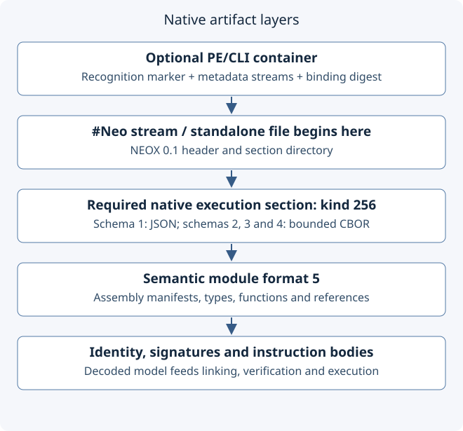

# neoCLR metadata format

Current reader/writer overview, reviewed 2026-10-09. This documents the implemented
transport and semantic model, not a finalized CLI extension standard. The
[extended metadata design](design/extended-cli-metadata.md) records the longer-term
CLI-derived direction and unresolved representation choices.



## Four different version and identity boundaries

| Layer | Current contract |
| --- | --- |
| Optional PE wrapper | Recognized PE/CLI metadata image containing `#Neo` |
| NEOX envelope | Magic `NEOX`, major 0, minor 1, section directory |
| Execution section | Kind 256, required; schema selects encoding and admission budgets |
| Semantic model | `Module.format = 5`; definitions, references and instruction bodies |

These numbers are independent. A schema-4 execution section is not semantic format 4.
A file extension is not sufficient evidence of either compatibility or validity.

## Envelope layout

The following offsets are relative to the start of NEOX. Integers in this header and
directory are unsigned little-endian. CBOR payloads follow CBOR's own encoding rules.

| Offset | Width | Field |
| --- | --- | --- |
| 0 | 4 bytes | ASCII magic `NEOX` |
| 4 | 2 bytes | Major version, 0 |
| 6 | 2 bytes | Minor version, 1 |
| 8 | 4 bytes | Section count, at most 64 |
| 12 | 4 bytes | Total envelope length |
| 16 | 16 bytes per section | Directory entries, followed by contiguous payloads |

Each directory entry contains `kind: u16`, `version: u16`, `flags: u32`,
`offset: u32`, `length: u32`. Flags 0 and 1 mean optional and required. Kinds are
nonzero and unique; section offsets must follow the directory and prior payloads
without gaps. The reader rejects trailing bytes and unknown required sections.
The native execution section must be required and have a supported schema.

| Execution schema | Payload | Envelope budget |
| --- | --- | --- |
| 1 | UTF-8 JSON, legacy | 1 MiB |
| 2 | Bounded CBOR, legacy binary profile | 1 MiB |
| 3 | Bounded CBOR, library profile | 8 MiB |
| 4 | Bounded CBOR, expanded library profile | 16 MiB |

The current Rust writer produces standalone schema 3, switching to 4 above the
8 MiB envelope threshold. It encodes the module directly, without a JSON intermediate.
Schemas 3/4 are accepted through the library-capable admission path. Older readers
need not accept newer schemas; rebuild with matching tooling rather than relabeling bytes.

## Binary payload

The binary payload serializes the runtime metadata object model using a restricted
[CBOR encoding (RFC 8949)](https://www.rfc-editor.org/rfc/rfc8949.html). It is not a
packed ECMA table heap or a native-memory dump. The reader requires definite lengths,
minimal integer/length arguments, UTF-8 text keys and unique map keys. It rejects
unsupported kinds, including tags, byte strings and floating-point CBOR values.
Floating constants use their model-specific representation rather than raw CBOR floats.

The profile limits nesting to depth 64 and nodes to 262,144 for legacy binary or
2,097,152 for library payloads. The library profile admits full unsigned 64-bit
integers. Profile validation precedes deserialization into the semantic model;
unknown model fields are rejected where the model declares strict field admission.
The implemented layout is defined by [native_binary.rs](../src/native_binary.rs),
[metadata.rs](../src/metadata.rs) and [metadata_origin.rs](../src/metadata_origin.rs).

## PE transport and consistency

The PE path wraps NEOX in the `#Neo` metadata stream. A metadata version marker begins
`neoCLR.NEOX.0.1;sha256=` followed by 64 lowercase hexadecimal digest characters.
The reader binds the metadata streams, ordered by name, using SHA-256 with a domain
prefix and length-prefixed names/payloads. This detects inconsistent stream contents;
it is not authentication or a trusted publisher signature.

Admission validates PE layout, stream ranges, alignment, duplicates, overlaps and
padding. The current profile rejects signatures and overlays. PE images are bounded
at 16 MiB; schemas 1/2 additionally retain the 4 MiB legacy image bound. NEOX may
have up to three zero padding bytes within its PE stream, outside its declared length.

**Native execution is authoritative in `#Neo`.** The runtime does not execute the
CLI method bodies in this wrapper. A CLI tool being able to open the PE does not
mean it can understand or execute the native payload. The temporary transport permits
existing PE tooling around a native model, at the cost of an additional representation
and consistency checks. Moving authority to standard CLI tables/bodies with explicit
extensions remains a design direction, not completed behavior.

## Contents and ownership

The format-5 module carries a name/revision, dependency references, optional entry point,
assembly manifests, type definitions and functions. Types and functions retain
signatures, generics, constraints, definition/reference identities, source origins
and applicable member metadata. Bodies carry typed instruction records. Runtime IR
branch indices and field indices must not be mistaken for ECMA byte displacements
or metadata tokens. Original metadata tokens and physical scopes are separate facts.

Assembly identity owns declarations. Logical declaration modules organize top-level
types, functions and constants; type-owned members retain their declaring type.
The manifest's `declaration_modules` version-1 table preserves explicit module names,
including empty modules. A module name plus its owning assembly identifies that
logical container. The existing `modules` list instead describes physical images.
Neither a dotted name nor a logical module creates a separate load lifetime.
See [declaration modules](declaration-modules.md) for validation and older-input projection.

```text
Assembly identity
  +-- physical metadata image(s): token/source scope
  +-- declaration_modules (version 1)
       +-- logical module name
            +-- top-level type --> fields, methods, properties
            +-- free function --> signature + instruction body
            +-- constant --> typed literal
```

## Admission is more than decoding

Container checks establish framing; payload checks establish encoding; dependency
resolution establishes owners and referenced definitions; typed verification checks
executable bodies. Successful decoding alone establishes none of the later guarantees.
Introspection and compiler import can inspect metadata without running application code.
See [architecture](architecture.md) and [IL inspection](il-inspection.md).

The maintained implementation evidence includes [container tests](../tests/metadata_container.rs),
[origin tests](../tests/metadata_origin.rs), [generic metadata tests](../tests/generic_metadata.rs)
and the binary reader's unit tests. These are existing evidence, not a fresh full-suite
qualification by this documentation change.

## Baseline and open direction

[ECMA-335, partitions II and III](https://ecma-international.org/publications-and-standards/standards/ecma-335/)
provides the CLI metadata and CIL baseline used by the project's recorded design research.
CBOR supplies object encoding, not type-system or instruction semantics (RFC reviewed
2026-10-09). Reusing ordinary CLI tables/opcodes where their meaning fits remains the
intended direction. The current object payload makes experiments and direct model
round trips practical, but requires coordinated reader/writer updates and does not
provide standard CLR execution, full CLI tooling interoperability or a frozen ABI.
See the [design comparison and migration limits](design/extended-cli-metadata.md).

## Init accessor extension (development, 2026-10-10)

Native property declarations optionally carry `init_only: true` (missing is false).
It requires an instance setter; the accessor association identifies a compiler-only
initialization restriction and grants that method the declaring type's readonly
field-write privilege. It adds no runtime freeze or new call instruction. Older
strict readers reject the new field. Both container codecs preserve the semantic
model. See [init accessors](init-accessors.md) for CLI projection, enforcement limits
and migration requirements.
